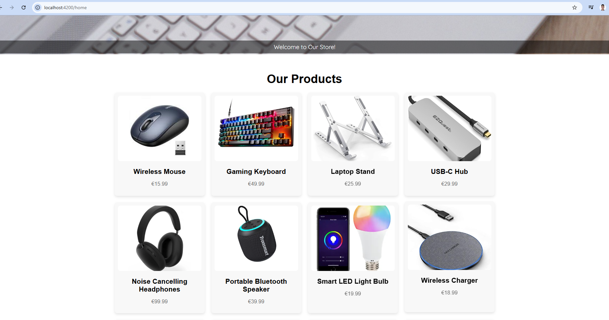

# E-Commerce Application

### Homepage


##Video 
[Watch the demo video on YouTube](https://www.youtube.com/watch?v=kseFmCaaPL4)

## Overview
This project is a full-stack e-commerce web application. It includes features such as product listing, adding products to a cart, placing orders, and order management. The application is built using Angular for the frontend and Node.js with PostgreSQL for the backend.

---

## Features
- Browse a product catalog
- Add products to a cart
- View cart details
- Place orders
- Admin panel for managing products and orders

---

## Technologies Used
### Frontend
- **Angular**: A powerful framework for building responsive and dynamic web interfaces.
- **TypeScript**: Enhances JavaScript by adding types.
- **CSS**: For styling and responsiveness.

### Backend
- **Node.js**: JavaScript runtime for building scalable server-side applications.
- **Express**: Minimalist web framework for Node.js.
- **PostgreSQL**: Robust relational database for storing application data.

---

## Installation

### Prerequisites
Ensure you have the following installed:
- [Node.js](https://nodejs.org/)
- [PostgreSQL](https://www.postgresql.org/)
- [Angular CLI](https://angular.io/cli)

### Steps

1. Clone the repository:
   ```bash
   git clone https://github.com/DcrKairm/MyEcomWebsite.git
   cd MyEcomWebsite
   ```

2. Set up the backend:
   ```bash
   cd backend
   npm install
   ```

3. Configure the database:
   - Update `backend/database.js` with your PostgreSQL credentials.
   - Run the provided SQL script to set up the database tables.

4. Start the backend server:
   ```bash
   npm start
   ```

5. Set up the frontend:
   ```bash
   cd ../frontend
   npm install
   ```

6. Start the frontend server:
   ```bash
   ng serve
   ```

---

## Usage
- Navigate to the frontend in your browser at `http://localhost:4200/`.
- Explore the product catalog and add items to your cart.
- Proceed to checkout to place an order.

---

## Project Structure

### Backend
- **`/routes`**: API routes
- **`/controllers`**: Request handlers
- **`/database`**: Database connection

### Frontend
- **`/components`**: Angular components
- **`/services`**: Services for API calls

---

## API Endpoints

### Product Endpoints
- **GET** `/api/products`: Fetch all products
- **POST** `/api/products`: Add a new product
- **PUT** `/api/products/:id`: Update a product
- **DELETE** `/api/products/:id`: Delete a product

### Cart Endpoints
- **GET** `/api/cart`: Fetch cart items
- **POST** `/api/cart`: Add item to cart
- **DELETE** `/api/cart/:id`: Remove item from cart

### Order Endpoints
- **POST** `/api/orders`: Place an order

---

## Contributing
Feel free to fork this repository and submit pull requests. Make sure to adhere to the coding standards and include proper documentation for new features.

---

## License
This project is licensed under the MIT License. See the [LICENSE](LICENSE) file for more details.

---

## Contact
For inquiries or support:
- **Email**: karim.bouchaane@edu.devinci.fr
- **GitHub**: [DcrKarim](https://github.com/DcrKarim)
- WAS DONE BY:
- Karim BOUCHAANE
